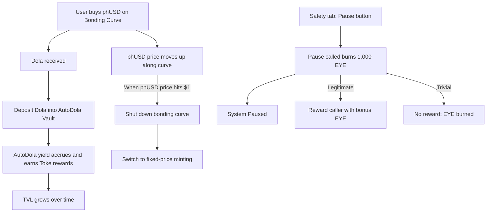
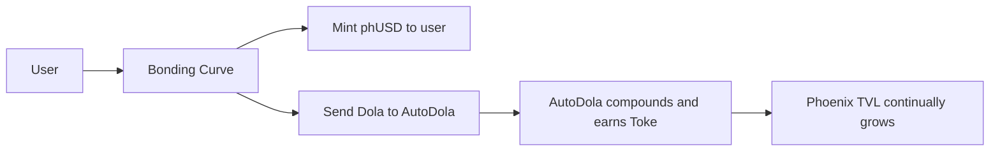
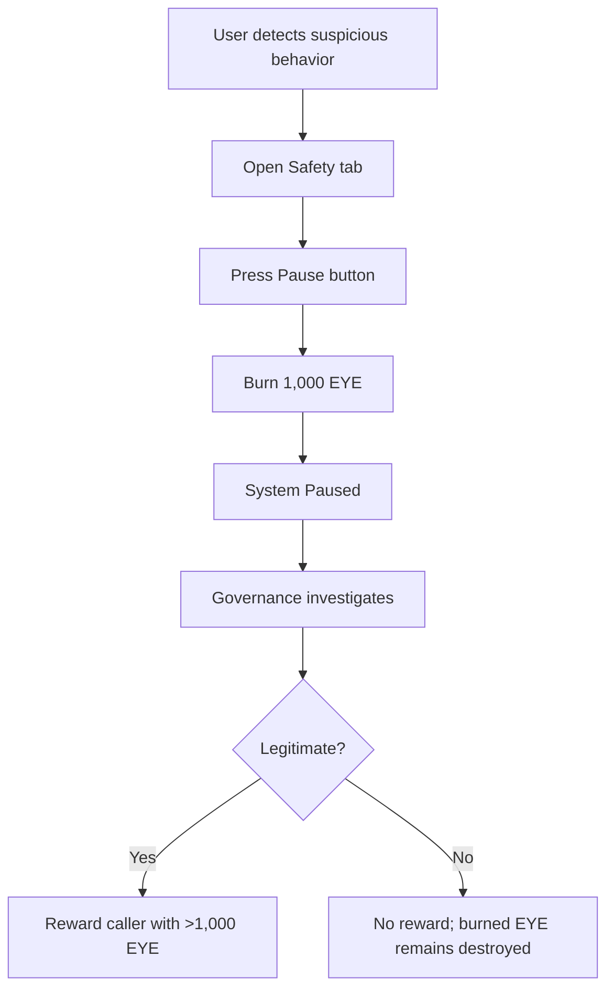

# Phoenix Phase 1: Capitalising phUSD with the Bonding Curve  

Phoenix begins with a simple but powerful mission: launch **phUSD** and build the liquidity foundation that will sustain it long term. Phase 1 focuses on capitalisation — raising collateral, bootstrapping liquidity, and ensuring phUSD is born strong.  

---

## Glossary  

| Term             | Description                                                                 |
|------------------|-----------------------------------------------------------------------------|
| phUSD            | The stablecoin produced by Phoenix                                                          |
| Dola             | Stablecoin used to mint phUSD.                                             |
| AutoDola         | Dola vault that yields growth through an increasing redeem rate, stored in the vault. |
| Toke             | Tokens earned by staking AutoDola.                                         |
| EYE              | Behodler governance token used by the micro-governance safety module.      |
| phUSD price      | The market price of phUSD in the liquidity pool, not to be confused with mint price. |
| phUSD mint price | The contract-set price at which phUSD is minted, distinct from the market price. |
| Yield            | The yield generated by the yield-bearing token in the Yield Vault.                                    |
| Vault token      | Refers to AutoDola.                                                        |
| Safety tab       | A dapp UI tab providing a pause button (micro-governance safety mechanism).|

---

## What Are Dola and AutoDola?  

- **Dola** is a widely used stablecoin created by Inverse Finance.  
- **AutoDola** is a vault that automatically compounds Dola, steadily increasing its redeem rate over time. Users who deposit Dola into AutoDola always benefit from this yield.  

Phoenix integrates AutoDola at its core: phUSD is minted with Dola. The Dola deposited is then converted into AutoDola ensuring that system collateral grows steadily.  

For a deeper dive into Dola and AutoDola, see [Inverse Finance’s docs](https://docs.inverse.finance/).  

---

## Phase 1 in Summary  

- phUSD launches with a **bonding curve**.  
- Purchases raise the phUSD price until it reaches **$1**.  
- All deposited Dola compounds in **AutoDola + Toke**, growing TVL steadily.  
- A micro EYE governance safety module provides an on-chain circuit breaker.  
- Once targets are reached, Phoenix transitions to **fixed-price minting**.  

---

### Phase 1 — High-Level Flow

---

## The Bonding Curve  

- phUSD launches at a <$1 price, gradually increasing as demand grows.  
- Purchases of phUSD push its price up along the bonding curve until it reaches $1.  
- At that point, Phoenix shuts down the bonding curve and switches to fixed-price minting at the contract-defined phUSD mint price of $1.  

This model ensures:  
- Early adopters can acquire phUSD cheaply.  
- Whales and speculators have space to participate.  
- Growth is supported as yield compounds inside Phoenix.  

---

## B3 Bonding Curve Mechanics  

Phoenix uses the **Behodler 3 bonding curve** to capitalise phUSD.  

In Behodler 3, you have virtual pairs of tokens where each token is paired to SCX. For the initial pair, the SCX created is an arbitrary amount but this sets the price of SCX. For instance, suppose you list USDC on Behodler 3 as the first token. Let's say the pair is (10000 USDC, 5000 SCX). This implies that the marginal SCX price is $2. Now suppose someone wishes to "mint" SCX. They would interact with this virtual pair as though it is a UniswapV2 pair. They'd send in USDC and the xy=k formula would determine how much SCX they get out.

In our case, let's say they buy SCX with 100 USDC. Prior to the trade,

```
xy=k 
k = 5000*10000 = 50,000,000
after trade, USDC increases to 10100
so, solving for x
x  = k/y
4950 = 50000000/10100
=> user gets 50 SCX
(this assumes no fees)
```
This has a number of advantages over Behodler 2 such as not having excessive early minting of SCX (the early bird attack vector) but that's all beyond the scope of this article.

## Where the Dola Goes  

The B3 bonding curve innovation of virtual liquidity means that when users buy phUSD, their Dola isn’t left idle. Instead, it is:  

1. Deposited into **AutoDola**, where it compounds automatically through the increasing redeem rate.  
2. Staked to earn **Toke** rewards.  

This means Phoenix’s TVL is always growing, even without new buyers.  



## Exploit Risk & Phase 1 Safety: the micro EYE governance module

Exploits are a real, present risk in DeFi. Audits, tests and formal verification reduce risk but do not eliminate it. Circuit breakers are a practical, last-resort defence. In Phase 1 Phoenix will trial a **micro EYE governance module** as a circuit-breaker:

- A **Safety** tab will appear in the dapp UI with a **Pause** button.  
- **Anyone** can call the Pause action; when called, the entire dapp pauses.  
- Calling Pause **burns 1,000 EYE** as an anti-griefer measure.  
- If the pause was justified and the caller explains their case, Phoenix will **reward the caller with more EYE than they burned** as a thank-you.  
- If a user calls Pause for trivial reasons (for example, a UI quirk or otherwise low-risk issues), **no reward** will be granted.



---

## Why This Works  

The Phase 1 bonding curve design solves the typical challenges of launching a stable, collateralized token:  

- **Speculator-friendly** – Continuous opportunity to buy low and sell higher as phUSD rises.  
- **Whale-friendly** – Large runway for heavy early participation.  
- **Early-adopter-friendly** – Continuous incentive curve, not a flat window.  
- **Inevitable TVL growth** – AutoDola and Toke ensure growth regardless of market activity.  
- **Circuit-breaker safety** – Micro EYE governance (Safety → Pause) provides an immediate, permissionless and costed emergency stop.    

---

## The Takeoff Point  

Phase 1 establishes Phoenix’s foundation — liquidity that grows by design, collateral that compounds automatically, and a safety framework that empowers users to act when needed.  

By combining Behodler 3’s bonding curve with AutoDola’s self-accreting yield, Phoenix achieves something rare in DeFi launches: capitalisation that strengthens over time rather than decays. Every minted phUSD deepens collateral and sets the stage for long-term stability.  

When the Ignition phase is complete Phoenix will transition to fixed-price minting, entering **Phase 2 – Stabilisation**, where phUSD finds its equilibrium through the Evergreen Loop.

Phase 1 is ignition — the moment Phoenix leaves the ground.  
From here, the system begins to fly on its own power.
